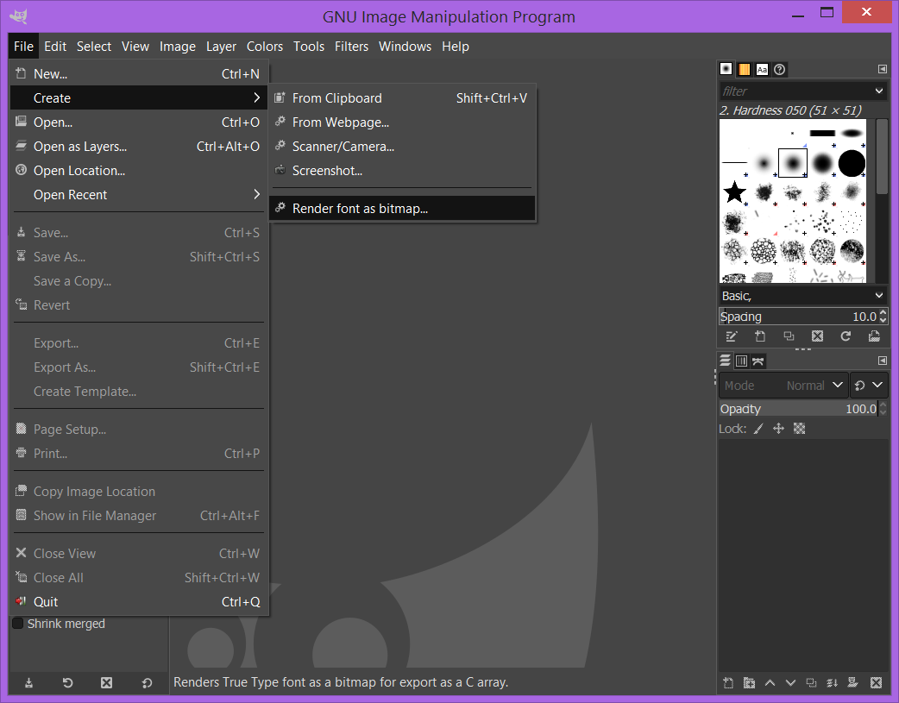
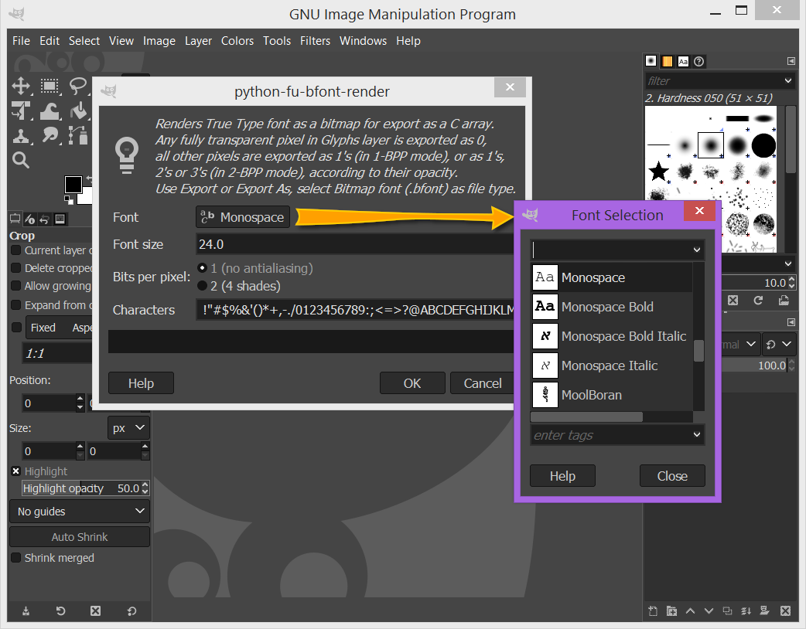
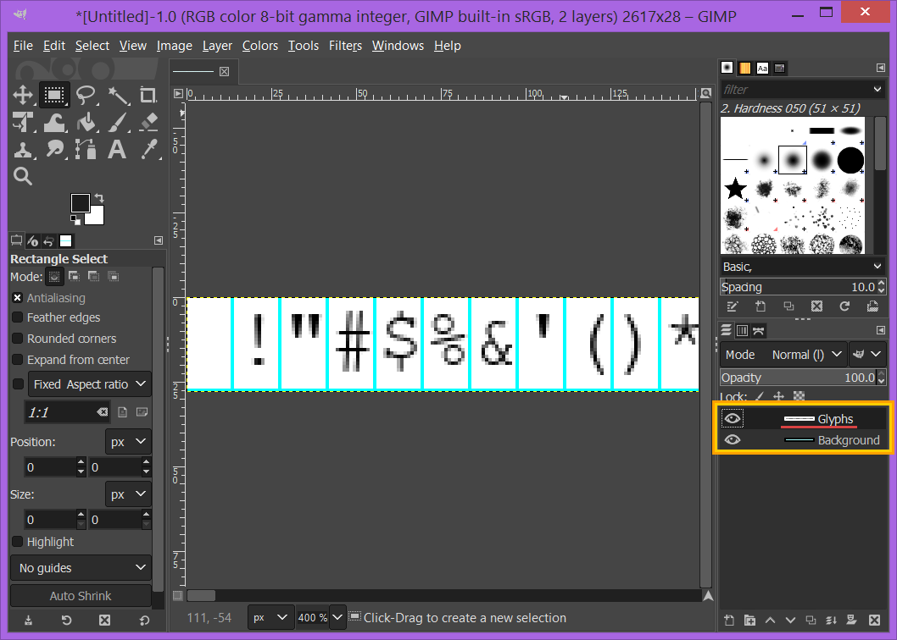
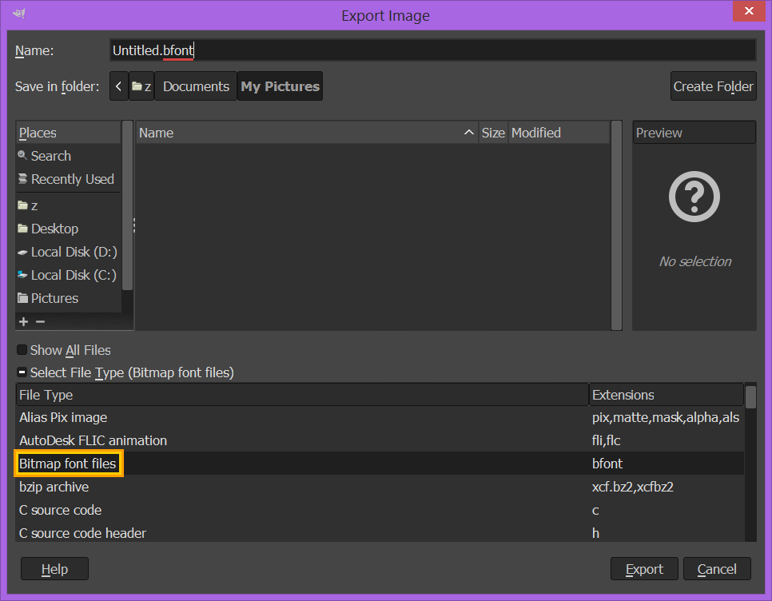

gimp_bfont
----------

Render fonts to bitmap images in Gimp and export them to C arrays.

This is a set of two plug-ins for [Gimp](http://www.gimp.org/) for **(a)** rendering system fonts as bitmapped images and **(b)** exporting said images to specific text files (.bfont files) containing C arrays, that can be used to render text.

The format of these arrays is described in the comments in .bfont files.

The plugins have been tested on Windows and Linux with GIMP 2.10.22, which is the latest stable version of GIMP as of this writing.

For an example of how to use the generated C arrays (in .bfont files), check out ``bfont_user_example`` folder.

### Installation

 - Copy **gimp_bfont_render.py** and **gimp_bfont_export.py** to your Gimp plugins folder. To find out its location, run Gimp and go to ``Edit > Preferences > Folders > Plug-ins`` (but pay attention to the peculiarities mentioned below);

 - (Skip if you're using Windows) Change file permissions by adding executable bit: ``chmod +x gimp_bfont_render.py``, ``chmod +x gimp_bfont_export.py``

 - Restart Gimp.

A couple of things I have noticed:

- on Windows, placing the files in `C:\Users\<Your Windows user>\AppData\Roaming\GIMP\2.10` does not work for whatever reason, but placing them in `C:\Program Files\GIMP 2\lib\gimp\2.0\plug-ins` works just fine (replace C: with the drive letter where you have GIMP installed);
- if you have installed GIMP using flatpak (this is the official way to do it on Linux at the moment), you're probably better off adding a new folder to the list of GIMP plug-in folders in ``Edit > Preferences > Folders > Plug-ins`` and copying the files into that folder. This is due to the way flatpak keeps installed applications sandboxed.

### Use

 - Go to **File -> Create -> Render font as bitmap...**

    

 - Select the font to render, select font size (note that your glyphs are normally taller than that, e.g. Roboto 24 has glyphs 31 pixel tall):

    

 - Choose between 1 bit per pixel (no antialiasing - jagged edges, font fits in fewer bytes) and 2 bits per pixel (smoother looking symbols, font arrays are larger);

 - Make sure all the characters you need are in the "Characters" text box;

 - Click OK to generate your image. The image is going to contain two layers: Glyphs and Background. The background layer is there just for reference.

Blue lines indicate right and bottom edges of each glyph. Any pixel of the glyph that falls on these blue lines belongs to its glyph, but pixels that lie to the right or below these blue lines are not considered to be a part of the glyph.
Font data is in the Glyphs layer. At this point you can start editing this layer. If you have rendered the font using 1 bit per pixel, pixels that are black (0, 0, 0) and fully opaque (255) are interpreted as "set" pixels. All other values are treated as "background" pixels by the exporter.

If you have rendered the font using 2 bits per pixel, just reuse the colors from the pixels. You can use the GIMP color picker tool to select the colors you want.

 You can save the image as Gimp **xcf** file and continue editing and export it later. Note that other formats, like tiff or png do not retain internal data structures needed by the exporter script, so do not use anything other than xcf.

 - When the font looks good to you, export it to **bfont** (bitmap font) format by using **File -> Export** or **Export As...**.
 You can select file type manually (choose Bitmap font files *.bfont), or just change the extension of your file to **.bfont**

 
