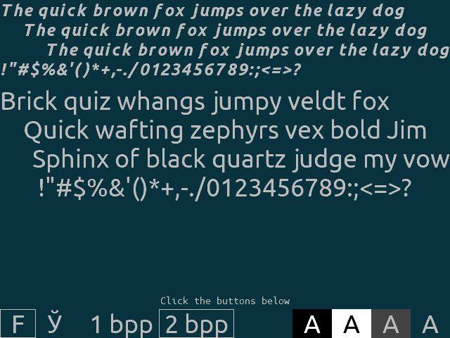

This is an example of using .bfont bitmapped font files (just plain C arrays in a self-documented text files really):

Dependencies: [SDL2](https://www.libsdl.org/download-2.0.php)

To compile on Linux, either

* run ``make`` or
* run ``build.sh``

The actual build command is ``gcc bfont_user.c bfont_user_fonts.c -lSDL2 -o bfont_user`` in either case.

Building on Windows should not be difficult, either, since SDL is cross-platform.